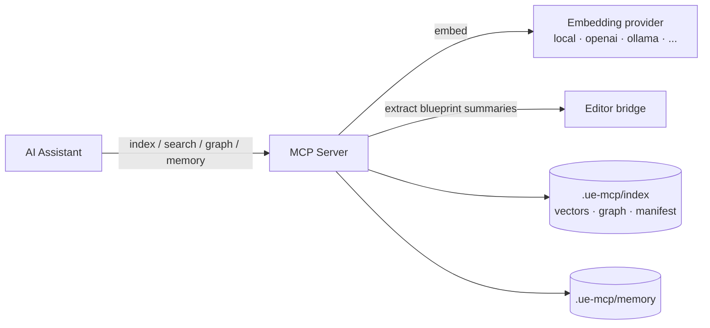

# Project Intelligence

The Project Intelligence layer gives the editor bridge a *memory and an understanding* of your project: a semantic index over code, config, docs, and blueprint summaries; a knowledge graph of dependencies; durable cross-session notes; live context capture; local code validation; and texture generation.

It is **local-first and model-agnostic**. With zero configuration it runs entirely offline using a built-in hashing embedding. Point it at a real embedding model (OpenAI, Voyage, Cohere, or a local Ollama) and the same tools transparently upgrade to dense semantic retrieval. Nothing here depends on a hosted account, and no project data leaves your machine unless you opt into an API provider.

All state lives under `<project>/.ue-mcp/` (git-ignorable, clearable at any time).



## Tools

| Tool | Purpose | Key actions |
|------|---------|-------------|
| `index` | Build/maintain the semantic index | `build`, `update`, `status`, `clear`, `ingest`, `ignore_patterns` |
| `search` | Retrieve relevant chunks with provenance | `hybrid`, `semantic`, `code_examples`, `references` |
| `graph` | Project knowledge graph | `build`, `project_map`, `hubs`, `neighbors`, `subgraph`, `path`, `find`, `stats` |
| `memory` | Durable cross-session notes | `list`, `read`, `write`, `append`, `delete` |
| `context` | Capture live editor working context | `get`, `capture_selection`, `capture_viewport` |
| `validate` | Check identifiers/code/plans vs reflection | `unreal_code`, `identifiers`, `blueprint_plan` |
| `image` | Text-to-image → import as texture | `generate`, `import`, `generate_and_import`, `list` |

## Quick start

```text
index(action="build")                       # index code/config/docs (+ blueprints if the editor is up)
index(action="status")                      # provider, dimensions, sources, chunk count
search(action="hybrid", query="apply damage to the player")
graph(action="build")                       # dependency + include graph
graph(action="project_map")                 # counts by kind + the most central blueprints/files
graph(action="neighbors", node="/Game/Blueprints/BP_Player")
memory(action="write", name="conventions", content="# Naming\nUI widgets are WBP_*")
validate(action="unreal_code", code="UCharacterMovementComponent* M = ...;")
```

### Recommended workflow

To answer "how does this project fit together / where is X / what depends on Y", build the index and graph first, then query them — this is far more reliable than reading files blind. Blueprint summaries and dependency edges require the editor connected; the code/docs index works fully offline and is filled in automatically on a later build once the editor is up.

## Configuration

Everything is optional. Add an `intelligence` block under `ue-mcp:` in `ue-mcp.yml`:

```yaml
ue-mcp:
  intelligence:
    embedding:
      provider: local        # local | openai | voyage | cohere | ollama  (default: local)
      # model: text-embedding-3-small
      # dim: 512             # local provider dimensionality
      # apiKeyEnv: OPENAI_API_KEY   # env var holding the key (never the key itself)
    image:
      provider: openai       # openai | stability | replicate
    ignore:
      - "Content/Developers/"  # extra gitignore-lite patterns
    maxFileSize: 1048576       # skip text files larger than this (bytes)
```

API keys are always read from **environment variables**, never stored in project config. If a configured API provider's key is missing, indexing falls back to the local embedding with a warning rather than failing.

You can also write ignore patterns to `.ue-mcp/INDEX_IGNORE` (one gitignore-lite pattern per line) or via `index(action="ignore_patterns", set=[...])`.

## How it works

- **Indexing** walks the project (honoring Unreal/SCM excludes and your ignore patterns), chunks text by a character budget with line provenance, embeds each chunk, and stores vectors in a compact JSONL store. A content-hash manifest makes rebuilds incremental — only changed files are re-embedded. Switching embedding providers or bumping the catalogue version forces a clean rebuild.
- **Blueprint summaries** come from the editor bridge: a dedicated `extract_index_summary` handler when the deployed plugin provides one, otherwise composed from `read_blueprint_graph_summary` + `get_blueprint_dependencies`.
- **Search** fuses dense cosine similarity with a lexical signal (query-token / phrase / symbol overlap), so exact identifier matches are never lost — important for code.
- **The knowledge graph** combines blueprint dependency edges with a C++ `#include` graph, then scores nodes by in-degree and PageRank centrality so the load-bearing hubs surface first. Path and neighborhood queries are plain BFS.
- **Memory** is just markdown files under `.ue-mcp/memory/` — human-readable and survives index rebuilds.

## Design principles

1. **Local-first, zero-setup.** Works offline with no dependencies and no account.
2. **Model-agnostic.** Embeddings, image generation, and (optionally) summarization are pluggable; you choose the model and own the keys.
3. **MCP-native.** This layer supplies *retrieval and structure*; the intelligence is whatever agent drives the MCP server. It exposes tools, not a bundled assistant.
4. **No new hard dependencies.** The vector store, graph, and providers are pure TypeScript; rich-document parsers (PDF/DOCX/PPTX/XLSX) load only if you install them.
